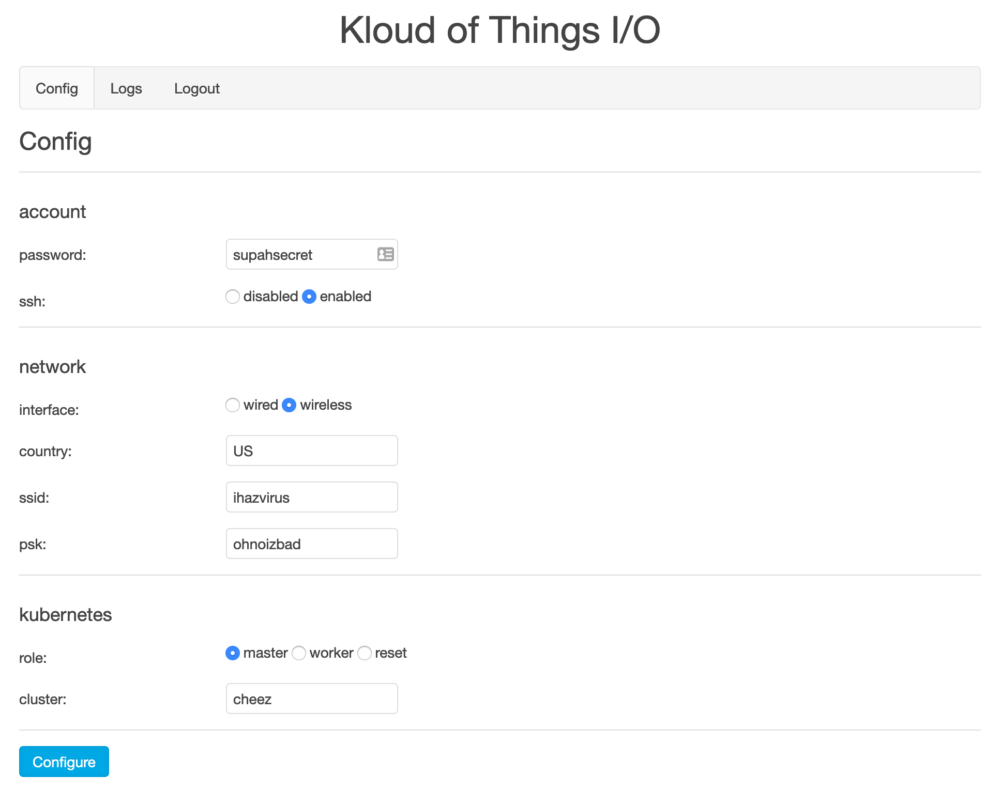
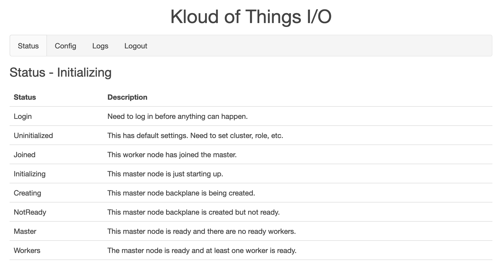
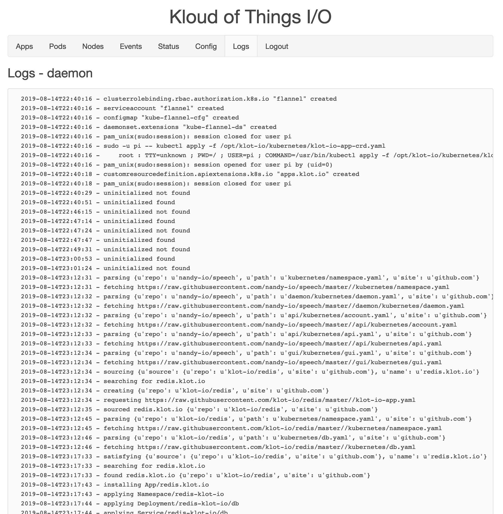
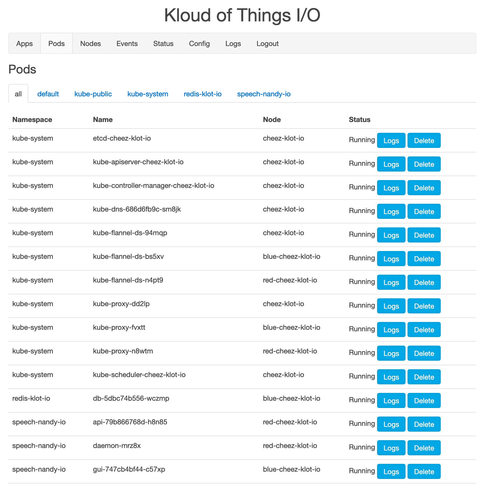
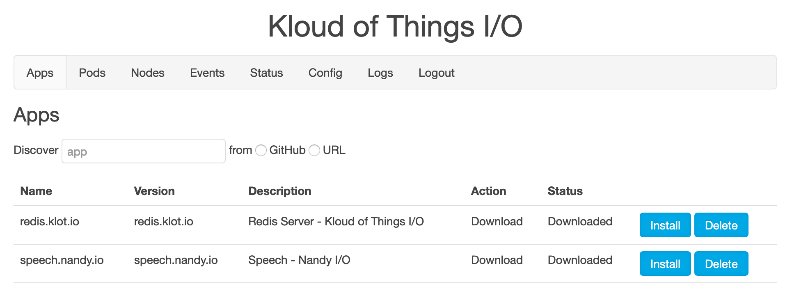

# GUI

For those not in the know, GUI stands for Graphical User Interface.
It's the little ol' website you log into do the things.

## Login

If you haven't logged in, this is the only page that'll work. 
The default passwords if nothing's been configured is 'kloudofthings' because I'm a man of mystery if anything. 
Just type in that or the password you changed everything to and hit return.

## Config

If you've logged in, but haven't set anything up, you'll end up at Config.
This is where you can configure (obvs) this Node. 

## Status

If you've congfigured, the Node has an idea of what's it's supposed to be and will send you here. 
This is the Status of the Node and contains a list of what each Status means.

## Logs

Here you can check in on this and other components by viewing ther logs.
- daemon - You can look at it's logs here, and see things like tracebacks like with the API.
- dns - Mini dns server's logs
- api - You can look at the API's logs here, and see things like tracebacks where things go super wrong.
- gui - The logs for this interface.  Nothing much interesting here. You can  mainly check the return code from the API.

## Nodes

These are all the Nodes of the your cluster, what their current statuses are, and how to add or remove Nodes from the cluster. 

NOTE: CPU is a percentage of cores.  I think I just assume 4.  I shouldn't do that. 

## Pods

Here you can see all the Pods in the Kuberenetes cluster and there status.
It's really only good for basic "Hey is this thing running yet?" but I plan to add Logs for the Pods as well. Correction, I seem to have already added Logs at some point. 

## Apps

This is where you can Install Apps or just Download Apps to check whats a gonna happenin'.
The Apps listing shows Action and Status.

Action is what you intend to happen.

- Download - Download the App and any Apps it requires. 
  - The App file and all the resources it specifies (file contents are stored on the App resouce).
  - Any Apps required by this App and all of their manifests (and requirements.
  - This only adds App resources to Kuberentes. It doesn't apply any manifests.
- Install - Download (if not already) and Install the App and any Apps it requires. 
  - Install required Apps first (and their dependencies first).
  - Apply this Apps resources (in proper order, Namespaces first, etc.)
  - Project required App's configuratoin into this Apps.
- Open - Open this App's URL (to access the App)
  - This really isn't an Action in Kubernetes, just some UX sugar because we like our Users.
- Uninstall - Remove this App's Resources from Kubernetes
  - Delete this Apps manifests (in opposite order, Namespaces last etc.)
  - Remove required App's configuratoin frpm this App.
  - Required Apps are not automatically Uninstalled and must be done so manually.
- Delete - Remove the App from Kubernetes entirely
  - Can only be done if not Installed.
  - Will no longer appear in the App listing.

Status is what's happened so far. 
- Discovered - The App resource is in Kubernetes, but not its manifests or dependencies.
- Downloaded - The App resource, manifests or dependencies are in Kubernetes.
- Installed - The App resource, manifests or dependencies are in Kubernetes.

If you click on a row, you get a deeper view into the App. 
- name - The name of the app, usually looks like a domain.
- description - Friendly, human happy explanation of the App.
- url - Link to access the App once installed.
- labels - Labels for the App, how to tag specific Nodes for specific uses.
  - I like to install Redis and on DB's on specific Node because either I have an external drive attached or I want the data kept in one place.
  - Certain Apps will only deploy functionality on Nodes that have hardware attached, like speakers, a button, or even a camera.
- action - What you intended the App to do.
- status - Where the App is currently at.
- error - If anythign went terribly wrong, that'll have the traceback.
- source - Where this App came from.
- resources - Tbe resources created when this App is installed.
