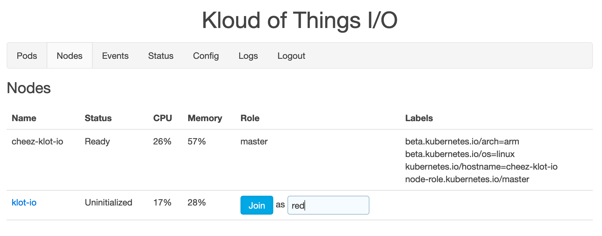
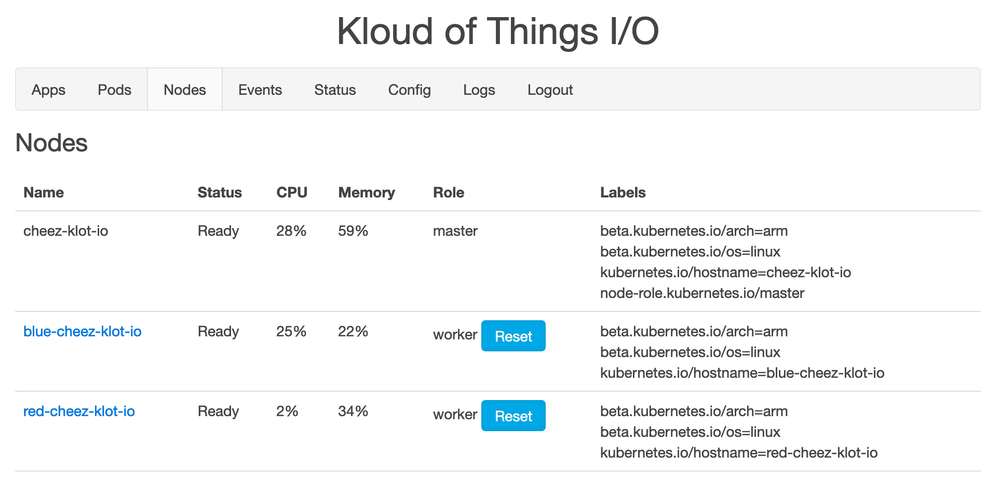

# Installation

## Easiest

### Requirements

- At minimum you'll need two Raspberry Pi's, probably the [3B+](https://www.raspberrypi.org/products/raspberry-pi-3-model-b-plus/)
  - Maybe it'll work with others?  I just haven't tried.
  - If you want to do more stuff, use like 3 or 4.
- You'll also need to be able to wire a Raspberry Pi to your network, ethernet style.
  - This is just for setup, and you only have to do it one at a time.

### Assumptions

- Your network has DHCP and you plan to use it
- You know how to reserve IP addresses on your remote (optional)

NOTE: There's a lot of stuff coming up and will eventually be consistent. If something doesn't work, wait a bit and try again. I'll be working on smoothing everything out.

### Burn 

- Download the [pi-0.1.img.zip](https://klot-io.sfo2.cdn.digitaloceanspaces.com/pi-0.1.img.zip) and burn it into an SD card. 
  - I'm fond of [Samsung's EVO Select 32Gb](https://www.samsung.com/us/computing/memory-storage/memory-cards/microsdhc-evo-select-memory-card-w--adapter-32gb--2017-model--mb-me32ga-am/) cards but use whatever you like.
  - I'm not an expert in which cards perform best or whatever.

### Login


- Insert SD card into Pi.  Wire to your network (ethernet cable). Power up.
- Wait a few minutes or so as the OS expands the filesystem. 
- Get impatient and go to [http://klot-io.local/](http://klot-io.local/) anyway, understanding it might not come up right away or be persnickety.
- Log in with the password 'kloudofthings'.
- Oh btw, you're logging into your new Pi right now.

### Configure Master


- Set a new password. This'll be both for the GUI/API you're using and the pi account on the Pi (make sure it's like 8 chars long).
- Decide whether to enable SSH or leave it disabled.  It's up to you, and you can change later through this page.
- Enter the WiFi settings for your network or leave it as is to stay wired.
  - You might want to go to your router and have the IP address for the Master reserved
  - This will prevent the IP from changing. Mine doesn't seem to need it but I don't know every router.
- Set the role to Master for this first one and give your cluster a name, lowercase, no spaces (I should have something check that and password too). 
- Click Config.  You should now have to log in with your new password.
- Note the site URL changed to (cluster)-klot-io.local. This is the hostname of the Master now and will be your home base going forward.
- Log in with your new password and wait for the status to change to Master
  - This'll take several minutes, might want to get a sandwich


### Join Workers



- Once the status is Master, burn another SD card, and plug it into a new Pi, wire to the network, and power up.
- Head over the Nodes page. After a few minutes, a Node called "klot-io" willl appear.  That's your new Node.
  - Wait for the Master to be Ready
  - Not sure why that status and the other aren't in sync
- You'll want to wait a few minutes as the hard drive reconfigures and the Pi reboots, it'll be be persnickety otherwise.
- To have it join as a Worker with the same settings as the Master, give it a name and click Join. 
- To have it join as a Worker with different settings, click it's name and Config on its own site.
- Back at the Master's Nodes, page, wait 20 seconds or so, and it'll appear in the Node listing as (name)-(cluster)-klot-io.local
- If you've switched from Wired to Wireless, it may hang as NotReady.  Give it a minute and then power cycle the Worker.
- Repeat for as many Workers as needed.
  - Do one at a time.
  - Just Make sure each name is unique (ya, should probably write something to check this too).



Congrats!  You have a Kubrernetes Cluster on Raspberry Pi's! Hit up [Apps](Apps.md) for what's next.

To see what this system can do, check out [GUI](GUI.md)

## Secure

This is a little more involved but more secure. 

This just works on Mac for now.  Happy to do Windows and Linux (which might already work as is?) when I have the chance.

### Requirements

- At minimum you'll need two Raspberry Pi's, probably the [3B+](https://www.raspberrypi.org/products/raspberry-pi-3-model-b-plus/)
  - Maybe it'll work with others?  I just haven't tried.
  - If you want to do more stuff, use like 3 or 4.
- You'll also need to be able to wire a Raspberry Pi to your network, ethernet style.
  - This is just for setup, and you only have to do it one at a time.
- docker
- docker-compose

### Assumptions

- Your network has DHCP and you plan to use it
- You know how to reserve IP addresses on your remote (optional)
- You know your way around docker and a command line in general

Basically, you can run the GUI locally and burn your settings right onto the cards before putting them into the Pi's.

- Burn the base image [pi-0.1.img.zip](https://klot-io.sfo2.cdn.digitaloceanspaces.com/pi-0.1.img.zip)
- Pop the SD card out after burning and pop it back in.
- Enable the cross compiler with `make cross`.
  - This allows ARM (Raspberry Pi processor) images to run on docker. 
- Type `make config` in this repo and go to http://127.0.0.1:8084 when docker compose is up.
- Configure this SD card as the master first.
- Ctrl-C to exit and then to a `make clean` to ensure there's no residual docker images running.
- Repeat for each worker SD card. Make sure you eject each SD from the Mac. 
- Put the cards in the Pi's and boot up.  
- After a few minutes, go to http://<cluster>-klot-io.local where <cluster> is the cluster you configured.

Check out [Apps](Apps.md) and [GUI](GUI.md) for more.

## H@X0rs ONLY


The config files to setup the Pi's are just basic YAML. Normally they're in the `/opt/klot-io/config/` directory, but if you put files in the `/boot/klot-io/config/` directory, they'll automatically be copied over and implemented accordingly.  That's all the above process is doing.  It's mounting the `/boot/klot-io/config/` inside the API container as `/opt/klot-io/config/`. So when it saves the config to `/opt/klot-io/config/` it ends up on `/boot/klot-io/config/` which is copied over when the Pi starts up. 

Here's the different files:

account.yaml - Controls the pi and GUI/API account

```yaml
password: # used for the pi user account and GUI/API loging
ssh:      # enabled|disabled
```

network.yaml - Controls the Pi's network connection for Kuberentes

```yaml
interface: # eth0 - wired | wlan0 - wireless
country:   # country code for wireless settings, ie US
ssid:      # SSID to connect to
psk:       # Password to connect with (leave blank for none)
```

kubernetes.yaml - Controls the Pi's role in Kubernetes

```yaml
role:      # master|worker|reset - completely resets Kubernetes via kubeadm reset
cluster:   # name of the cluster
name:      # name of the node (worker only)
```

- Burn the base image [pi-0.1.img.zip](https://klot-io.sfo2.cdn.digitaloceanspaces.com/pi-0.1.img.zip)
- Pop the SD card out after burning and pop it back in.
- Put your YAML files in `/Volumes/boot/klot-io/config`
  - Make sure you use the same password for each
  - The Kuberentes token the Workers use for joining is derived from this password
- Repeat for each Pi, making sure to use slightly different `kubernetes.yaml` files for each

## SSD

This is how to boot off of a SSD harddrive for installation. I put this here because I'll forget otherwise.

### requirements

- A hard drive like [this](https://www.amazon.com/gp/product/B073H552FK/ref=ppx_yo_dt_b_search_asin_title?ie=UTF8&psc=1)

### process

- Burn the base image [pi-0.1.img.zip](https://klot-io.sfo2.cdn.digitaloceanspaces.com/pi-0.1.img.zip) onto the SSD
- `make config` (if you want)
- Boot with the SSD attached (no SD card)
- `sudo lsblk` to determine the partition (usually sda)
- `sudo fdisk /dev/sda` to repartition
- `p` to copy start of sda2
- `d` and accept default to delete the 2 partition (it's ok)
- `n` new primary (default), 2 (default) paste the start, and all the way to the end (default), n to not remove signature
- `w` to write 
- `sudo shutdown -r now` to reboot
- `sudo resize2fs /dev/sda2` to resize